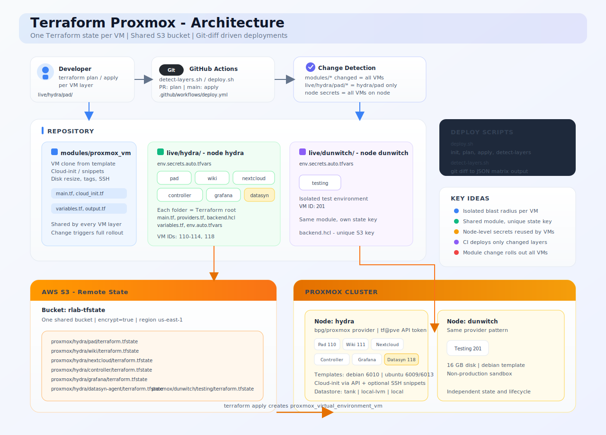

# Terraform Proxmox

Infrastructure-as-code para máquinas virtuales en [Proxmox VE](https://www.proxmox.com/). Cada VM es un Terraform root independiente con su propio remote state, un module compartido reutilizable y CI que solo hace plan/apply de lo que cambió en git.



---

## ¿Qué es este repositorio?

Este repo gestiona **VMs de Proxmox como código**. No instala software de aplicación dentro de las VMs: provisiona las máquinas (CPU, RAM, disco, red, cloud-init, SSH keys).

| Concepto | Significado |
|----------|-------------|
| **Layer** | Una VM = una carpeta bajo `live/<node>/<vm>/` |
| **Node** | Un host Proxmox (p. ej. `hydra`, `dunwitch`) |
| **Module** | `modules/proxmox_vm` — clone de template, resize de disco, cloud-init |
| **State** | Bucket S3 `rlab-tfstate`, una key por VM |
| **Secrets** | Archivo por node: `live/<node>/env.secrets.auto.tfvars` (no se commitea) |
| **Config** | Por VM: `env.auto.tfvars` (nombre, vm_id, cores, disk, IP, …) |

**¿Por qué un state por VM?** Al cambiar un servicio solo se hace plan/apply de esa VM. Los cambios en el module siguen desplegándose en todas las VMs (código compartido).

---

## Setup inicial

Haz esto una vez antes del primer deploy local.

### 1. Instalar herramientas locales

Consulta [Requisitos locales](#requisitos-locales) más abajo, o usa el [prompt de setup](#prompt-de-setup-para-asistente-ia) para instalar todo en una máquina nueva.

### 2. Clonar el repositorio

```bash
git clone https://github.com/rlyehlab/terraform_proxmox.git
cd terraform_proxmox
```

### 3. Configurar AWS (S3 backend)

Terraform guarda el state en `s3://rlab-tfstate`. Tus credenciales AWS necesitan acceso de lectura/escritura a ese bucket.

```bash
aws configure
# o export AWS_PROFILE / AWS_ACCESS_KEY_ID / AWS_SECRET_ACCESS_KEY
aws sts get-caller-identity   # verificar acceso
```

### 4. Configurar secrets de Proxmox (por node)

```bash
cp live/hydra/env.secrets.auto.tfvars.example live/hydra/env.secrets.auto.tfvars
```

Edita `live/hydra/env.secrets.auto.tfvars`:

```hcl
proxmox_api_url      = "https://<proxmox-host>:8006"
proxmox_api_token    = "tf@pve!token-name=<secret>"
password             = "<tf@pve password>"
proxmox_ssh_password = ""   # dejar vacío si usas ssh-agent para root@proxmox
```

Repite para otros nodes (`live/dunwitch/`, …) cuando despliegues allí.

### 5. Setup único en Proxmox (en el node)

Ejecuta en el host Proxmox vía SSH:

```bash
# Rol Provisioner
pveum role add Provisioner -privs "Datastore.Allocate Datastore.AllocateSpace Datastore.AllocateTemplate Datastore.Audit Pool.Allocate Sys.Audit Sys.Console Sys.Modify VM.Allocate VM.Audit VM.Clone VM.Config.CDROM VM.Config.Cloudinit VM.Config.CPU VM.Config.Disk VM.Config.HWType VM.Config.Memory VM.Config.Network VM.Config.Options VM.Migrate VM.PowerMgmt SDN.Use"

# Usuario API de Terraform
pveum user add tf@pve --password '<password>'
pveum aclmod / -user tf@pve -role Provisioner
pveum user token add tf@pve terraform-token --privsep 0
```

Los **templates** de cloud-init deben existir en Proxmox antes de clonar VMs. Créalos con `create_template/ubuntu/create-template.sh` si faltan.

### 6. Desplegar una VM

```bash
bash .github/scripts/deploy.sh terraform-init  hydra/pad
bash .github/scripts/deploy.sh terraform-plan  hydra/pad
bash .github/scripts/deploy.sh terraform-apply hydra/pad
```

Sustituye `hydra/pad` por cualquier layer bajo `live/` que tenga un `main.tf`.

---

## Requisitos locales

| Herramienta | Versión | Uso |
|-------------|---------|-----|
| [Terraform](https://developer.hashicorp.com/terraform/install) | >= 1.5 | Plan y apply de infraestructura |
| [AWS CLI](https://docs.aws.amazon.com/cli/latest/userguide/getting-started-install.html) | v2 | Autenticación con S3 remote state |
| [Git](https://git-scm.com/) | reciente | Clonar repo, change detection en CI |
| [jq](https://jqlang.github.io/jq/) | cualquiera | Salida JSON de `detect-layers` |
| SSH client + agent | — | Opcional: subir cloud-init snippets a Proxmox como `root` |

**Accesos necesarios**

- Credenciales AWS con acceso al bucket `rlab-tfstate` (region `us-east-1`)
- API token de Proxmox para el usuario `tf@pve`
- Conectividad de red a la API de Proxmox (`https://<host>:8006`)
- SSH key que coincida con una public key del layer (`env.auto.tfvars` o `locals.tf`)

**Verificar**

```bash
terraform version
aws --version
aws sts get-caller-identity
```

---

## Prompt de setup (para asistente IA)

Copia el bloque siguiente en Cursor, ChatGPT u otro asistente en una **máquina nueva** para instalar prerequisitos y validar el entorno de este proyecto:

```text
Necesito ejecutar el repo Terraform Proxmox en local en macOS (o Linux). Ayúdame a instalar y verificar todo.

Contexto del proyecto:
- Repo: terraform_proxmox — un Terraform root por VM bajo live/<node>/<vm>/
- Remote state: bucket AWS S3 rlab-tfstate, region us-east-1
- Herramientas: Terraform >= 1.5, AWS CLI v2, git, jq, bash
- Deploy helper: bash .github/scripts/deploy.sh terraform-init|plan|apply <node>/<vm>
- Archivo de secrets (no en git): live/hydra/env.secrets.auto.tfvars con proxmox_api_url, proxmox_api_token, password, proxmox_ssh_password opcional

Por favor:
1. Detecta mi OS y package manager (Homebrew en macOS, apt/dnf en Linux).
2. Instala Terraform (>= 1.5), AWS CLI v2, git y jq si faltan.
3. Muestra cómo configurar credenciales AWS (aws configure o env vars) y verificar con aws sts get-caller-identity.
4. Muestra cómo clonar el repo y copiar live/hydra/env.secrets.auto.tfvars.example a env.secrets.auto.tfvars.
5. Ejecuta terraform version y un terraform init de prueba para un layer, p. ej. hydra/pad:
   bash .github/scripts/deploy.sh terraform-init hydra/pad
6. Lista lo que aún falte (token Proxmox, VPN, SSH agent) que deba aportar manualmente.

No commitear secrets. Usar placeholders en los ejemplos.
```

---

### Flujo
0. Un **developer** crea un layer (`live/<node>/<vm>/`), aca se puede crear la VM, mediante el IDE (Con una skill)
1. Un **developer** o **GitHub Actions** ejecuta Terraform para un layer (`live/<node>/<vm>/`).
2. El layer carga los **secrets del node** desde `live/<node>/env.secrets.auto.tfvars`.
3. Terraform lee/escribe el **remote state** en `s3://rlab-tfstate/proxmox/<node>/<vm>/terraform.tfstate`.
4. El module compartido **`modules/proxmox_vm`** llama a la API de Proxmox, hace full-clone de un template y aplica cloud-init.
5. La VM arranca con el usuario, SSH keys, disco, bridge y **IP estática** (cloud-init) configurados.

---

## Red e IP estática

Las VMs reciben IP vía cloud-init en el bloque `initialization.ip_config` del module `proxmox_vm`. Por defecto es `dhcp`; cada layer puede fijar IP estática en `env.auto.tfvars`:

```hcl
network_bridge = "vmbr1"
ipv4_address   = "10.13.10.118/24"
ipv4_gateway   = "10.13.10.1"
```

| Recurso | Uso |
|---------|-----|
| `live/<node>/ip-allocations.yaml` | Registro de IPs y bridges por VM |
| `modules/proxmox_vm` | `ipv4_address`, `ipv4_gateway`, `dns_servers`, `network_bridge` |
| Output `vm_ipv4_address` | IP estática configurada, o descubierta por QEMU agent si es DHCP |

**Red en hydra:** todas las VMs usan **`vmbr1`** / **`10.13.10.0/24`** (gateway **`10.13.10.1`**). Ver `live/hydra/ip-allocations.yaml`.

**Migrar VMs existentes de DHCP a estática:** cloud-init solo aplica en el primer arranque. Un `apply` que cambie `ip_config` puede requerir recrear la VM o ajuste manual en el guest. Haz plan primero y revisa si hay `forces replacement`.

**Apply requiere confirmación explícita** — usa `terraform plan` para revisar; el apply no se ejecuta automáticamente en local salvo que lo confirmes:

```bash
bash .github/scripts/deploy.sh terraform-plan  hydra/pad
# Revisar el plan, luego:
bash .github/scripts/deploy.sh terraform-apply hydra/pad
```

---

### Layout del repositorio

```
terraform_proxmox/
├── live/<node>/<vm>/     # Un Terraform root por VM
│   ├── main.tf           # module "vm" { ... }
│   ├── backend.hcl       # S3 state key única
│   ├── env.auto.tfvars   # Sizing, vm_id, tags
│   └── providers.tf
├── live/<node>/env.secrets.auto.tfvars   # gitignored
├── modules/proxmox_vm/   # Module compartido de VM
├── .github/scripts/deploy.sh
└── create_template/      # Crear templates cloud-init en Proxmox
```

### Nodes de Proxmox

| Node | Layers | Patrón de state key |
|------|--------|---------------------|
| `hydra` | Varias VMs bajo `live/hydra/*/` | `proxmox/hydra/<vm>/terraform.tfstate` |
| `dunwitch` | `testing` | `proxmox/dunwitch/testing/terraform.tfstate` |

---

## Uso diario

### Plan / apply de una VM

```bash
bash .github/scripts/deploy.sh terraform-init  hydra/grafana
bash .github/scripts/deploy.sh terraform-plan  hydra/grafana
bash .github/scripts/deploy.sh terraform-apply hydra/grafana
```

### Ver qué layers cambiaron (lógica de CI)

```bash
bash .github/scripts/deploy.sh detect-layers HEAD~1 HEAD
```

| Cambio | Efecto |
|--------|--------|
| `modules/proxmox_vm/**` | Plan de todas las VMs en CI |
| `live/hydra/<vm>/**` | Solo esa VM |
| `live/hydra/env.secrets.auto.tfvars` | Todas las VMs del node `hydra` |

### SSH a una VM

El usuario es `vm_user` de `env.auto.tfvars` (normalmente `user`), no `root`. Con IP estática, usa la IP de `env.auto.tfvars` o del output `vm_ipv4_address`:

```bash
# IP estática (desde env.auto.tfvars del layer)
ssh -i ~/.ssh/<key> -o IdentitiesOnly=yes user@10.13.10.118

# Si aún usas DHCP, consulta en Proxmox:
qm guest cmd <vm_id> network-get-interfaces
```

---

## CI/CD

Workflow: `.github/workflows/deploy.yml`

| Evento | Acción |
|--------|--------|
| Pull request | `terraform plan` en los layers modificados |
| Push a `main` | `terraform apply` en los layers modificados |
| `workflow_dispatch` | Deploy de un layer vía input `layer` |

GitHub secrets: `AWS_ROLE_ARN`, `PROXMOX_API_URL`, `PROXMOX_API_TOKEN`, `PROXMOX_PASSWORD`, `PROXMOX_SSH_PASSWORD`.

---

## Agregar una VM nueva

Usa el skill de Cursor en `.cursor/skills/create-vm/SKILL.md`, o copia un layer existente:

```bash
cp -R live/hydra/pad live/hydra/my-service
# Editar backend.hcl (state key única), env.auto.tfvars (vm_id, IP, disk, …)
# Registrar la IP en live/hydra/ip-allocations.yaml
bash .github/scripts/deploy.sh terraform-init  hydra/my-service
bash .github/scripts/deploy.sh terraform-plan  hydra/my-service
```

Elige un `vm_id` libre en el node destino (`qm list` en Proxmox).

---

## Referencias

- [Provider Terraform bpg/proxmox](https://registry.terraform.io/providers/bpg/proxmox/latest/docs)
- [Imagen Ubuntu cloud-init para Proxmox](https://austinsnerdythings.com/2021/08/30/how-to-create-a-proxmox-ubuntu-cloud-init-image/)
- [Desplegar VMs en Proxmox con Terraform](https://austinsnerdythings.com/2021/09/01/how-to-deploy-vms-in-proxmox-with-terraform/)
